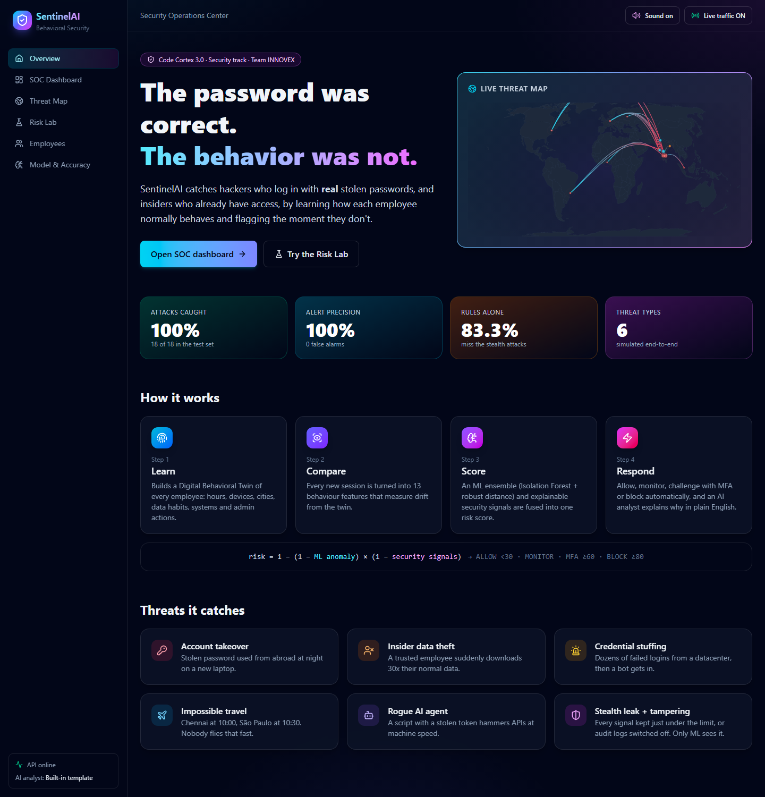
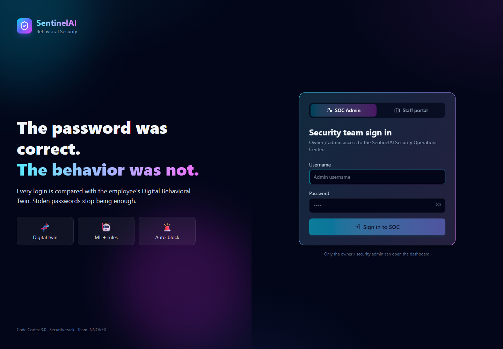
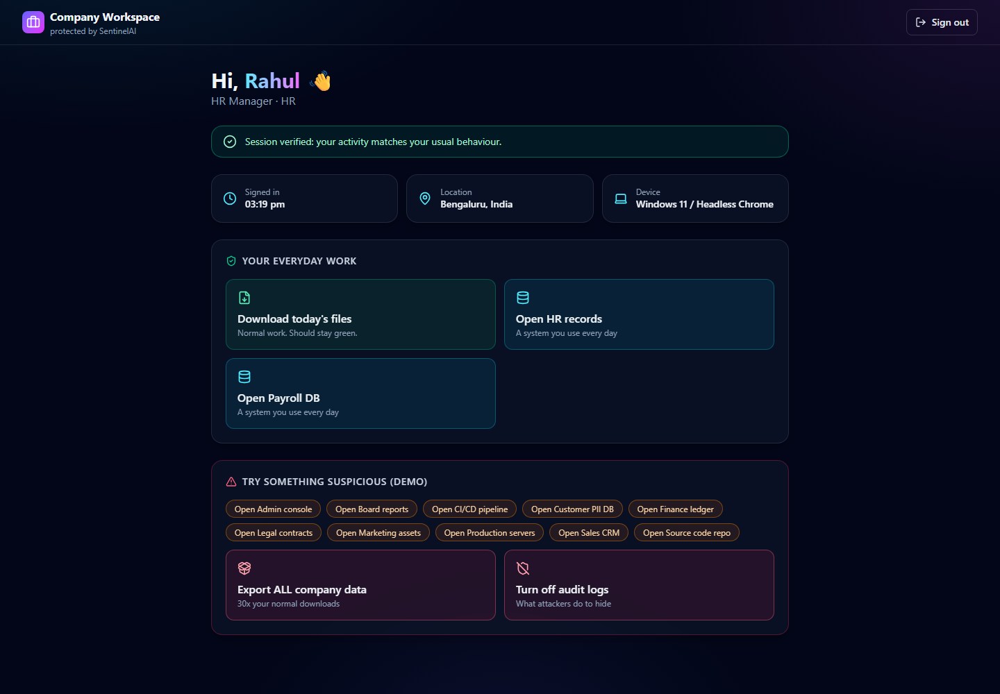
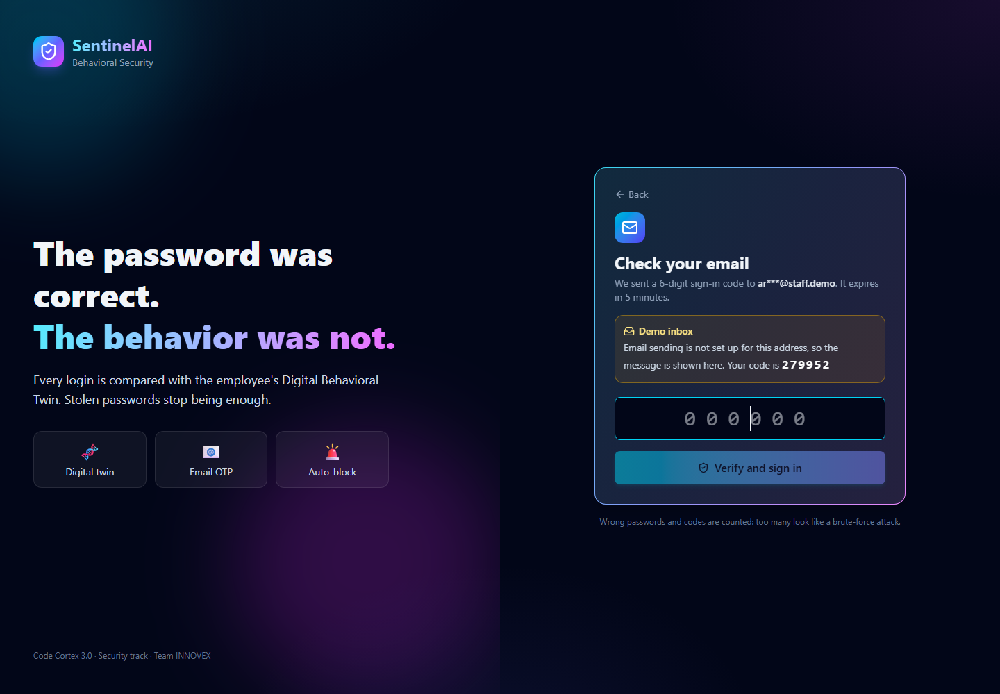
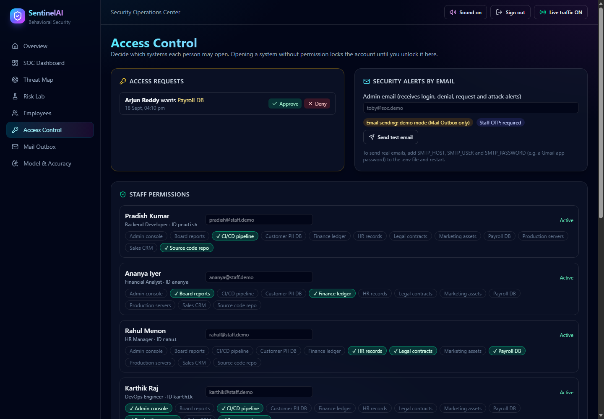
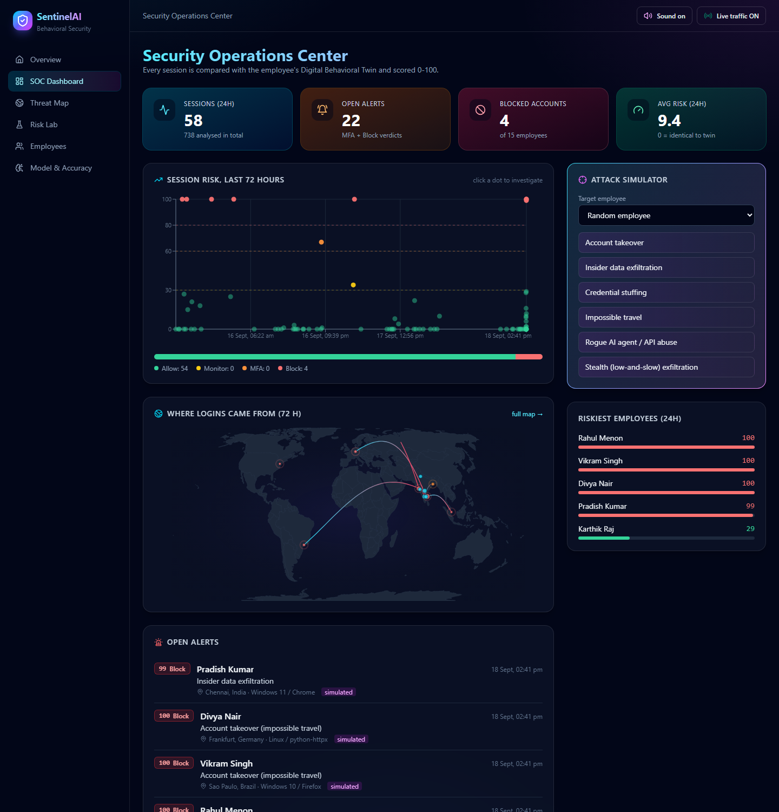
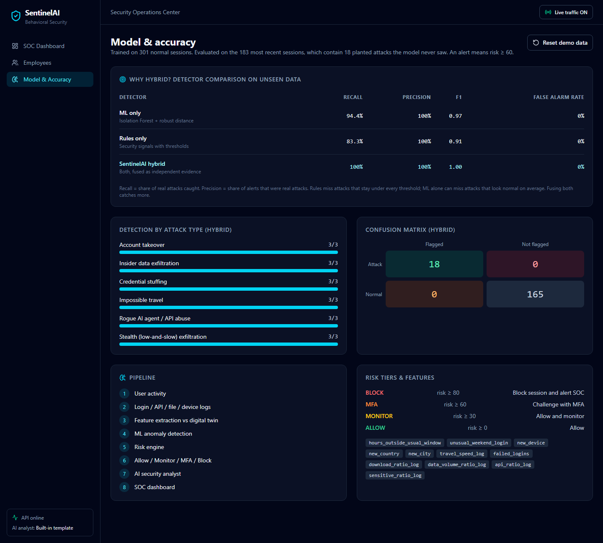
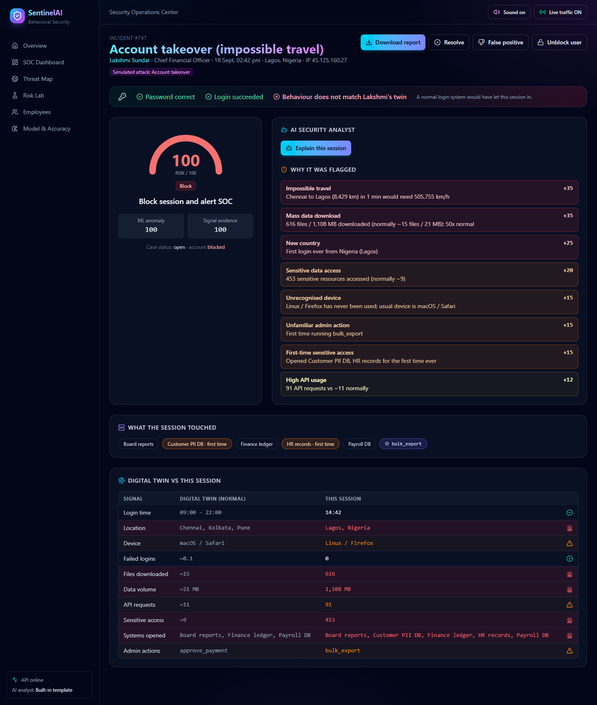
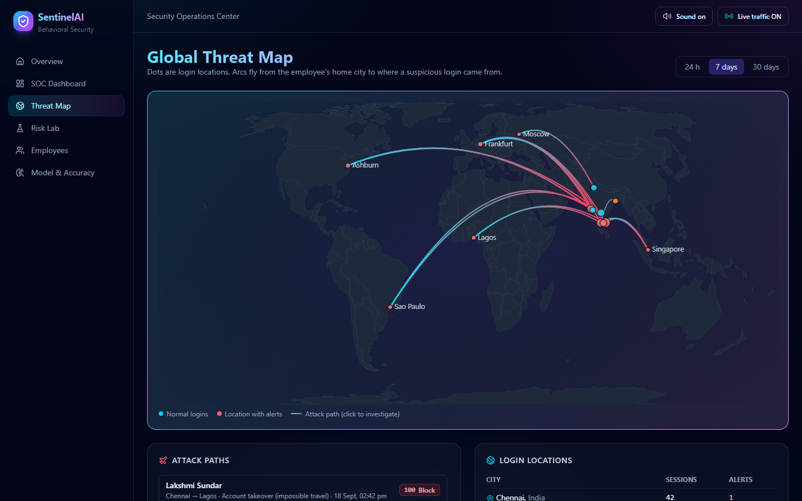
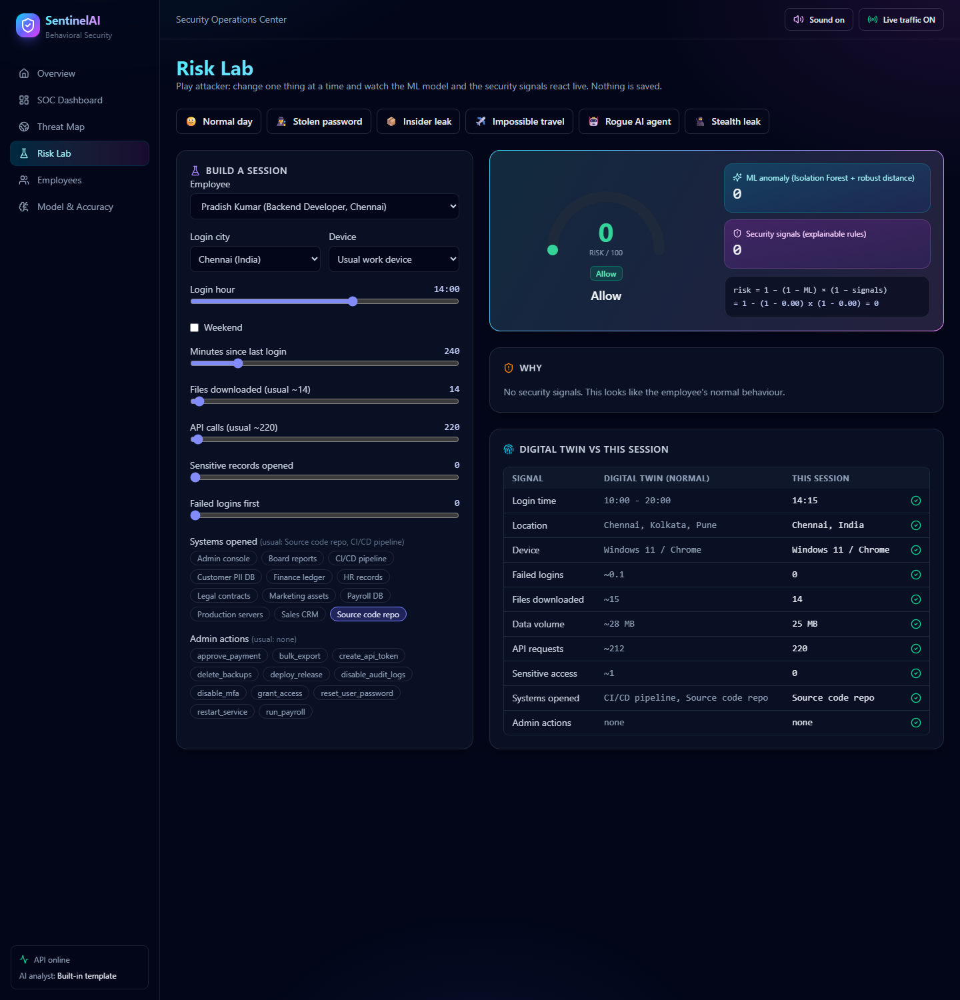

# 🛡️ SentinelAI: Behavioral Security for Detecting Compromised Users

**Code Cortex 3.0 · Security track (Cyber & Defense) · Team INNOVEX**

> ### *The password was correct. The behavior was not.*

Passwords, OTPs and session tokens get stolen. Once an attacker has them, they *are* the user as far as authentication is concerned. SentinelAI asks a different question: **does this session behave like the real person?**

Each employee gets a **Digital Behavioral Twin** learned from their history: when they log in, from where, on which device, how many files and API calls they make, which sensitive systems they open, and which admin actions they normally perform. Every new session is compared with that twin, scored **0-100** by an ML + rules hybrid, and handled automatically:

| Risk | Tier | Action |
|---|---|---|
| 0-29 | ALLOW | Allow |
| 30-59 | MONITOR | Allow and monitor |
| 60-79 | MFA | Challenge with MFA |
| 80-100 | BLOCK | Block session, auto-lock the account, alert the SOC |

An **AI Security Analyst** (Claude, with an offline fallback) explains each incident in plain English.



## Logins

The front page is a login screen. Nothing is visible until someone signs in.

**SOC admin / owner:** username `TOBY`, password `5429`, **plus a 6-digit code from an authenticator app or sent to the admin's email** (set `ADMIN_EMAIL` and a Gmail app password in `.env`) (Google or Microsoft Authenticator). On the first admin sign-in a QR code appears: scan it once with your phone. Lost the phone? Run `python backend/reset_admin_2fa.py`. Change the login with `ADMIN_USERNAME` / `ADMIN_PASSWORD`, or turn the app check off with `ADMIN_2FA=false` in `.env`.

**Staff portal (demo accounts).** A guest signs in as an employee with **password + a 6-digit code sent by email**, and the admin dashboard shows them under **Staff online now** with a live risk score. Their real device, their **device location (GPS / mobile network / Wi-Fi, never typed in)** and wrong password/code attempts are scored. Passing the email code enrols the device as trusted.

**Access control.** On the **Access Control** page the admin switches each person's access to each system on or off and sets their email. In the portal, staff get an awareness note before opening something for the first time, and a warning for systems they have no access to. Opening one anyway **locks the account until the admin unlocks it**. Staff can also request access, which the admin approves or denies.

**Email alerts.** The admin is emailed when staff sign in, are denied access, request access or get flagged. Staff get awareness notes and unlock notices. If the sign-in code is sent to, or the account is switched to, an email the person never used, SentinelAI adds an *Unfamiliar email* signal (a common account-takeover move) and warns the usual address. Without SMTP settings, every email is shown in the dashboard's **Mail Outbox** and the code appears on the sign-in screen (demo mode). Add `SMTP_USER` / `SMTP_PASSWORD` (e.g. a Gmail app password) to `.env` for real email.

Actions such as *Export ALL company data*, *Turn off audit logs* or opening a decoy file get the account locked in real time.

| Staff ID | Password | Employee | Role | Office |
|---|---|---|---|---|
| `pradish` | `4821` | Pradish Kumar | Backend Developer | Chennai |
| `ananya` | `7306` | Ananya Iyer | Financial Analyst | Chennai |
| `rahul` | `1957` | Rahul Menon | HR Manager | Bengaluru |
| `karthik` | `6643` | Karthik Raj | DevOps Engineer | Bengaluru |
| `divya` | `3198` | Divya Nair | Account Executive | Mumbai |
| `arjun` | `8570` | Arjun Reddy | Data Scientist | Hyderabad |
| `meera` | `2764` | Meera Krishnan | Legal Counsel | Delhi |
| `vikram` | `9415` | Vikram Singh | Payroll Specialist | Pune |
| `sneha` | `5082` | Sneha Patel | Content Lead | Mumbai |
| `aditya` | `6239` | Aditya Rao | Frontend Developer | Chennai |

**How guests reach it**

| Situation | What to do |
|---|---|
| Guest on the **same Wi-Fi / hotspot** | Open `http://<your-laptop-ip>:5173` (shown on the dashboard and by `start.bat`) |
| Guest on **mobile data or another network**, or college Wi-Fi that blocks device-to-device traffic | Double-click **`share.bat`** (after `start.bat`). It creates a temporary public `https://….trycloudflare.com` link, copies it to the clipboard, and switches it off when the window is closed |
| No network at all | Use a second browser window on the same laptop |

A locked account can be unblocked from **Employees**. After 5 wrong admin passwords the admin login pauses for 2 minutes.









> These are demo credentials for a hackathon. For real use, keep the admin password in `.env` and store staff passwords hashed in the database.

## Security of SentinelAI itself

| Control | How |
|---|---|
| Admin 2-step login | Password + time-based code from an authenticator app (TOTP, RFC 6238); admin sessions expire after 4 hours |
| Staff 2-step login | Password + 6-digit code by email; passing it enrols the device |
| Password storage | PBKDF2-SHA256, 200,000 iterations, per-user salt (no plain passwords in the code) |
| Brute-force protection | Admin: 5 wrong attempts pause sign-in for 2 minutes. Staff: 5 wrong passwords in a row lock the account until the admin unlocks it |
| Least privilege | Per-system permissions; opening a system without permission locks the account |
| Audit log | Every sign-in, failed attempt, unlock, block, permission change and request decision, with time, actor and IP (**Security Center** page) |
| API protection | Every endpoint needs a signed token (HMAC-SHA256); staff tokens only reach the staff portal; security headers on every response |

## The trained model

The model is saved as files in [`model/`](model/), including a **readable JSON copy of every tree** (`sentinel_model.json`), a 40-line scorer that uses only that file (`predict_example.py`), the first tree as if/else rules, per-feature statistics, the training rows and charts. The binary copy is `sentinel_model.npz` (all 200 trees, the learned medians and spreads, and the calibration, as plain NumPy arrays with no pickle) and `model_card.json` (algorithms, parameters, what was learned per feature, training data and test results). The **Model & Accuracy** page shows the card and has download buttons. Retrain with `cd backend && python train_model.py --check`, or on your own logs with `--data my_logs.csv`. See [`model/README.md`](model/README.md) to load and use it.

## Run on real data (CMU CERT r4.2)

SentinelAI can run entirely on the real CERT insider-threat dataset instead of the demo company:

1. Download `r4.2.tar.bz2` and `answers.tar.bz2` from Carnegie Mellon's KiltHub and extract them to `C:\cert`
   (see `backend/cert_to_sentinel.py` for the exact commands).
2. `cd backend && python cert_to_sentinel.py --cert C:\cert` (about 3 minutes, 59,165 employee-days).
3. Set `SENTINEL_MODE=cert` in `.env` and run `start.bat`. The first start trains on the real data (about 2 minutes).

The dashboard then shows the 200 real employees (70 labelled insiders) and the model is trained on their behaviour.
The staff portal and attack simulator belong to the demo company, so they are off in this mode.
The CERT licence forbids publishing the data or anything derived from it, so CERT mode uses its own
database and `model/cert/`, both git-ignored. Set `SENTINEL_MODE=demo` to switch back.

## Features

| | Feature | What it shows |
|---|---|---|
| 🪤 | **Decoy files (honeytokens)** | Tempting files on the shared drive (`CEO_Salaries_2026.xlsx` …). Opening one is a near-certain sign of snooping: +60 risk instantly |
| 🏆 | **Beat-SentinelAI challenge** | Guests try to take data without getting caught; the dashboard counts attempts vs. caught |
| 🛑 | **Live SOC controls** | Lock an account or force-sign-out a signed-in person straight from *Staff online now* |
| 🖥️ | **Desktop notifications** | Windows notifications for blocks and logins, even when the dashboard tab is in the background |
| 🛡️ | **Security Center** | Controls in force and the audit log of every sign-in and admin decision |
| 🧠 | **Trained model files** | `model/sentinel_model.npz` + `model_card.json`, shown and downloadable on the Model page |
| 🎓 | **Self-learning loop** | Marking an alert "False positive" teaches that person's twin at once; twins follow drift from safe recent sessions; "Retrain with feedback" trains a challenger model that goes live only if it misses no held-out attacks (champion / challenger, versioned) |
| 👥 | **Peer groups + onboarding** | Add or offboard employees from the Employees page; a new joiner's twin starts from their department's habits until they have 10 sessions of their own; every employee is compared with their peers |
| 🔌 | **Integrations** | Reads sign-in logs from Okta, Microsoft Entra ID, Google Workspace and AWS CloudTrail (`POST /api/ingest/<source>` with an API key); pushes alerts to Slack, Teams, SMS / WhatsApp (Twilio), a signed webhook and a SIEM (syslog CEF); exports CEF / JSON lines / CSV |
| 📊 | **Tested on real data** | Accuracy is measured on the **real CMU CERT r4.2 insider-threat dataset** (59,165 employee-days, 200 people, 70 labelled insiders): AUC 0.899 (rules alone 0.525), and all 16 insiders in the test period flagged at least once when 5% of normal days are flagged. ROC and precision-recall curves on the Model page |
| 📧 | **Email OTP + access control** | Staff sign in with password + emailed code; admin grants per-system access; no-permission attempts lock the account until unlocked; unfamiliar-email detection; Mail Outbox |
| 🔐 | **Login** | Admin login guards the dashboard; staff portal for live demo logins, shown as *Staff online now* |
| 🏠 | **Overview page** | The problem, how it works in 4 steps, live accuracy and a mini threat map |
| 📊 | **SOC dashboard** | Live sessions, risk timeline, open alerts, riskiest employees, department heatmap |
| 🌍 | **Global threat map** | Login locations worldwide; animated attack arcs from the employee's home city to the suspicious login |
| 🧪 | **Risk Lab** | "Play attacker": sliders and presets change a session and the ML score, signals and fusion formula update live |
| 🎯 | **Attack simulator** | Six attack types launched on any employee in one click |
| 🔔 | **Real-time alerts** | Pop-up toasts with an alarm sound (mute toggle) whenever a session is challenged or blocked |
| 🔍 | **Incident view** | Risk gauge, "Password ✓ Login ✓ Behaviour ✗" banner, reasons with points, systems and admin actions touched, twin comparison |
| 🤖 | **AI security analyst** | Plain-English incident summary (Claude, with an offline template fallback) |
| 📄 | **Incident report** | One-click *Download report* (print / save as PDF) |
| 🔒 | **Automatic response** | BLOCK verdicts auto-lock the account; analysts can resolve, mark false positive, block or unblock |
| 📈 | **Model & accuracy** | ML-only vs rules-only vs hybrid on held-out attacks |



---

## Architecture

```
User activity
     ↓
Login / API / file / device logs
     ↓
Feature extraction (session vs. Digital Twin, 13 features)
     ↓
ML anomaly detection (Isolation Forest + robust distance, from scratch in numpy)
     ↓
Risk engine (ML score ⊕ explainable security signals)
     ↓
Allow · Monitor · MFA · Block + Alert
     ↓
LLM security analyst
     ↓
SOC dashboard (React)
```

| Layer | Tech |
|---|---|
| Backend API | Python, FastAPI, SQLAlchemy |
| Database | PostgreSQL (Docker) / SQLite (local) |
| ML | Isolation Forest + RobustDistance, **implemented from scratch with numpy** |
| AI analyst | Claude via the Anthropic SDK, with a built-in template fallback |
| Frontend | React, Vite, Tailwind CSS, Recharts, d3-geo (threat map) |
| Deployment | Docker Compose |

## How detection works

1. **Digital twin.** From each employee's past sessions: usual login hours, known devices, known cities and countries, average files, data volume, API calls and sensitive-resource access, plus the sensitive systems (Payroll DB, Customer PII DB, ...) and admin actions they normally use.
2. **Features.** Each session becomes 13 numbers that measure drift from the twin, e.g. hours outside the usual window, new device or country, travel speed from the last trusted session, failed logins, log-ratios of downloads, data volume, API calls and sensitive access, and the number of never-before-used sensitive systems and admin actions.
3. **ML (unsupervised, trained only on normal behavior).**
   - *Isolation Forest* spots unusual **combinations** of features.
   - *Robust distance* (median/MAD) spots extreme **magnitudes**, which a forest cannot score beyond its most extreme training point.
   - ML risk = the higher of the two, calibrated so a typical session is 0 and the 95th-percentile normal session is 25.
4. **Signals.** Readable evidence with points: impossible travel, new country, unrecognized device, automation client, mass download, sensitive data access, machine-speed API usage, brute-force pattern, first-time access to a sensitive system, unfamiliar admin action, **security tampering** (disabling audit logs or MFA, deleting backups) and more.
5. **Fusion.** ML and signals are treated as independent evidence: `risk = 1 − (1 − ML)(1 − signals)`.
6. **Response.** The risk tier decides the action. A BLOCK verdict auto-locks the account.

**Last trusted session.** Travel speed is measured from the user's last *non-blocked* session, so an attacker's login never becomes the reference point for the real user.

## Results

Evaluated on the most recent 10 days of the dataset (190 sessions containing 18 planted attacks the model never trained on). An alert means risk ≥ 60.

| Detector | Recall | Precision | False alarm rate |
|---|---|---|---|
| ML only | 100% | 100% | 0% |
| Rules only | 83.3% | 100% | 0% |
| **SentinelAI hybrid** | **100%** | **100%** | **0%** |

All 6 attack types were caught 3/3: account takeover, insider exfiltration, credential stuffing, impossible travel, rogue AI agent / API abuse, and **stealth (low-and-slow) exfiltration**. The stealth attack deliberately stays under every rule threshold, so the rules alone miss it and only the ML model catches it. The rules still matter: they turn the ML's "this is unusual" into readable reasons an analyst can act on, and a strong signal such as security tampering raises the risk even when the ML is unsure. That is why the system is hybrid.

Robustness check across 8 differently seeded datasets: hybrid recall was 100% on every one and precision was at least 94.7% (at most 1 false alarm per dataset).

> ⚠️ **Honest note:** the data is synthetic. The hackathon's security dataset has no login/file/device logs, so SentinelAI ships a realistic simulator (15 employees, shift patterns, business trips, 6 attack types). Numbers on real enterprise logs would be lower. The pipeline accepts any CSV with the same columns, so it can be retrained on real data (e.g. the CERT Insider Threat dataset).



---

## Quick start

### Easiest (Windows): double-click `start.bat`

Needs only Python 3.11+. On the first run it installs everything. If Node.js is missing it downloads a portable copy, so nothing extra needs installing. Then it starts the API and dashboard and opens http://localhost:5173. To stop, close the two *SentinelAI* windows.

### Option A: Docker (everything in one command)

Needs [Docker Desktop](https://www.docker.com/products/docker-desktop/).

```bash
cp .env.example .env          # optional: add ANTHROPIC_API_KEY for Claude explanations
docker compose up --build
```

- Dashboard: http://localhost:3000
- API docs (Swagger): http://localhost:8000/docs

### Option B: Run locally (no Docker)

Needs Python 3.11+ and Node.js 20+.

**Backend** (terminal 1):

```bash
cd backend
python -m venv .venv
# Windows:  .venv\Scripts\activate      macOS/Linux:  source .venv/bin/activate
pip install -r requirements.txt
uvicorn main:app --reload --port 8000
```

Local runs use SQLite (`backend/sentinel.db`), created and seeded automatically on first start.

**Frontend** (terminal 2):

```bash
cd frontend
npm install
npm run dev
```

Open http://localhost:5173.

### Enable Claude explanations (optional)

Put `ANTHROPIC_API_KEY=...` in `.env` at the repo root. Without a key, or if the API is unreachable, the analyst uses a built-in template, so the demo never depends on the internet.

## Demo script (3-5 minutes)

1. **Login as TOBY.** Hand a friend your phone or a second browser: they sign in to the **Staff portal** (e.g. `rahul` / `1957`). A green *Staff logged in* toast appears and they show up under **Staff online now**. Ask them to click *Export ALL company data* or open a file on the *Shared drive* (a decoy): their account is locked live and the alarm goes off. Challenge the audience to beat SentinelAI and show the scoreboard.
2. **Overview.** *"The password was correct. The behavior was not."* Walk through the 4 steps.
3. **SOC dashboard.** Live traffic is on and normal sessions stream in green. *"Every dot is a login compared with that employee's digital twin."*
4. **Attack simulator → Account takeover.** The alarm sounds, a toast pops up, the session appears as a red BLOCK and the account is auto-locked.
5. **Open the incident.** Show the "Password ✓ Login ✓ Behaviour ✗" banner, the reasons, the systems and admin actions touched, and the twin comparison. Click **Explain this session**, then **Download report**.
6. **Threat map.** The attack arc flies from the employee's city to the attacker's.
7. **Risk Lab.** Start from *Normal day* (risk 0). Change the city to Moscow, then turn on `disable_audit_logs`, and watch the risk climb live. Try *Stealth leak* to show the ML catching what the rules miss.
8. **Model & Accuracy page.** ML only vs rules only vs hybrid, on data the model never saw.







## API

| Method | Endpoint | Purpose |
|---|---|---|
| POST | `/api/auth/login` | Admin login → token (all other endpoints need `Authorization: Bearer <token>`) |
| POST | `/api/auth/staff-login` | Staff portal login; creates a scored session |
| GET/POST | `/api/staff/me`, `/me/heartbeat`, `/me/activity`, `/me/logout` | Staff portal (staff token) |
| GET | `/api/staff/active` | Staff online now, with live risk |
| GET | `/api/health` | Status, AI analyst mode, LAN address |
| GET | `/api/stats` | Dashboard KPIs |
| GET | `/api/events` | Sessions (filters: `limit`, `min_risk`, `user_id`, `tier`) |
| GET | `/api/alerts` | MFA/BLOCK incidents (`status=open\|resolved\|false_positive\|all`) |
| GET | `/api/events/{id}` | Incident detail + digital twin comparison |
| POST | `/api/events/{id}/explain` | AI analyst explanation (`?refresh=true` to regenerate) |
| PATCH | `/api/events/{id}/status` | Resolve / mark false positive |
| GET | `/api/users`, `/api/users/{id}` | Employees, twin and session history |
| POST | `/api/users/{id}/block`, `/unblock` | Manual account control |
| GET | `/api/timeline` | Risk over time |
| GET | `/api/scenarios` | Available attack simulations |
| POST | `/api/simulate` | Launch an attack `{scenario, user_id?}` |
| GET | `/api/map` | Login locations and attack arcs (`hours`) |
| GET | `/api/departments` | Department x signal heatmap (7 days) |
| GET | `/api/lab/options` | Risk Lab choices (employees, cities, devices, systems, actions) |
| POST | `/api/lab/score` | Score a what-if session without saving it |
| GET | `/api/model` | Evaluation metrics |
| GET/POST | `/api/live` | Toggle background traffic |
| POST | `/api/reset` | Reload the demo dataset |

Interactive docs: http://localhost:8000/docs

## Project structure

```
SentinelAI/
├── backend/
│   ├── main.py                 # FastAPI app and endpoints
│   ├── auth.py                 # admin + staff logins, signed tokens
│   ├── detection_service.py    # pipeline: seed, train, score, evaluate, simulate
│   ├── feature_engineering.py  # digital twin + 13 features
│   ├── ml_detector.py          # Isolation Forest + RobustDistance (numpy)
│   ├── risk_engine.py          # signals, fusion, risk tiers
│   ├── analyst.py              # Claude / template incident explanations
│   ├── simulator.py            # synthetic employees and 6 attack scenarios
│   ├── database.py, models.py  # SQLAlchemy
│   └── requirements.txt
├── frontend/src/
│   ├── pages/                  # Landing, Dashboard, ThreatMapPage, RiskLab, Employees, Incident, Model, ...
│   ├── components/             # threat map, heatmap, alert toasts, charts, gauge, simulator
│   └── api.js
├── data/
│   ├── synthetic_security_events.csv
│   └── generate_dataset.py
├── docs/screenshots/
├── docker-compose.yml
└── .env.example
```

## Customising

- **Regenerate data:** `python data/generate_dataset.py --days 60 --seed 42`, then delete `backend/sentinel.db` (or click *Reset demo data*).
- **Use real logs:** replace `data/synthetic_security_events.csv` with a CSV that has the same columns (`scenario` can be empty).
- **Tune thresholds:** tiers and signal points are in `backend/risk_engine.py`; ML calibration is in `backend/ml_detector.py`.
- **Add employees or attacks:** `PROFILES` and `make_attack()` in `backend/simulator.py`.

## Future work

- Streaming ingestion from real identity providers (Azure AD / Okta sign-in logs, CloudTrail).
- Rolling twin updates with analyst feedback (false-positive labels fed back into training).
- Session-token fingerprinting to catch cookie theft.
- Detection of autonomous AI agents abusing internal APIs, using request-timing signatures.
- Peer-group baselines (compare a new joiner with others in the same role).

## Team INNOVEX (Guild code CC-3048)

- **Palani Bharathi S** (26BCE2603), team leader
- _Add teammates' names and roles here_
