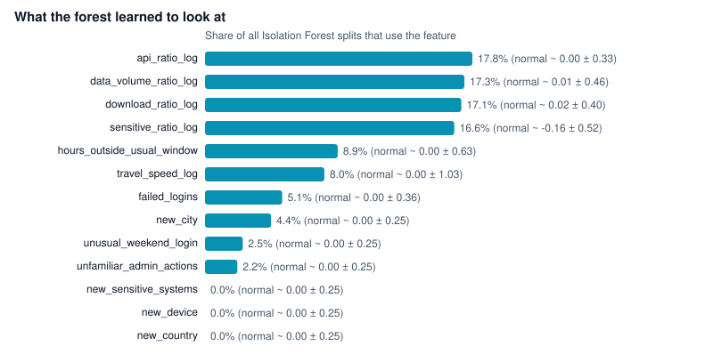
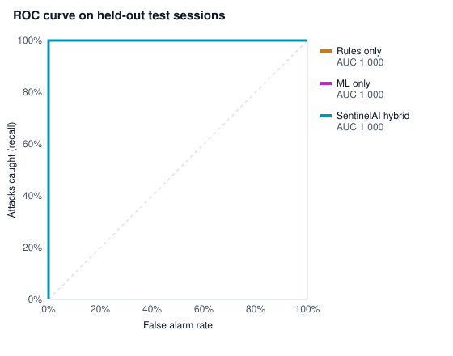
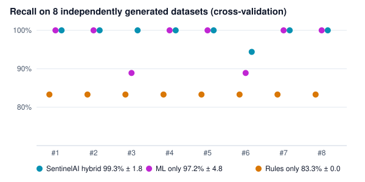

# SentinelAI trained model

This folder is the trained model: every number it learned, in files you can open on GitHub.

| File | Open it to see |
|---|---|
| [`sentinel_model.json`](sentinel_model.json) | **The whole model as text**: all 200 Isolation Forest trees (every split feature and threshold), the Robust Distance medians and spreads, and the calibration. Same content as the `.npz`. |
| [`predict_example.py`](predict_example.py) | Scores sessions using only `sentinel_model.json` and NumPy, with no SentinelAI code, so you can see exactly how a risk number is produced. Run `python model/predict_example.py`. |
| [`tree_000.txt`](tree_000.txt) | The first of the 200 trees written out as `if / else` rules |
| [`feature_statistics.csv`](feature_statistics.csv) | For each of the 13 features: what a normal session looks like (median and spread) and how much the forest uses it |
| [`training_features.csv`](training_features.csv) | The exact 298 feature rows the model was trained on (normal behaviour only) |
| [`model_card.json`](model_card.json) | Summary: algorithms, parameters, training data, test results, limitations |
| [`evaluation.json`](evaluation.json) | Cross-validation over 8 datasets and results on real labelled data (CMU CERT) |
| `sentinel_model.npz` | Fast binary copy of the same model (NumPy arrays, no pickle). GitHub can't preview binary files; `sentinel_model.json` is the readable version. |

## What the model learned



Behaviour volumes (API calls, data, downloads, sensitive records) and working hours drive most splits.
"New device / new country / new sensitive system" are always 0 in normal training data, so the forest
never splits on them; the Robust Distance model and the security rules cover those instead.

## How well it works





On our own synthetic data the curves are near perfect because the attacks follow patterns we designed.
Cross-validation over 8 freshly generated companies gives **99.3% ± 1.8% recall** for the hybrid.
Real-data results on the CMU CERT insider-threat dataset are in `evaluation.json` and on the
**Model & Accuracy** page.

## How a session is scored

1. The session is turned into **13 features**, each measuring how far it is from the person's
   digital twin (for example `download_ratio_log` = log of downloads vs. their own average).
2. **Isolation Forest** (200 trees): unusual sessions are isolated in fewer random splits.
3. **Robust Distance**: how many "normal spreads" each feature sits above normal (median / MAD).
4. Each score is calibrated: median normal session = 0, top 5% of normal = 25. ML risk = the higher of the two.
5. The final risk combines ML with security rules: `risk = 1 - (1 - ML/100) × (1 - rules/100)`,
   then **Allow < 30 ≤ Monitor < 60 ≤ MFA < 80 ≤ Block**.

## Use it from code

```python
import sys; sys.path.insert(0, "backend")
import numpy as np
from ml_detector import load_detector

model = load_detector("model/sentinel_model.npz")
session = np.array([[5, 0, 1, 1, 1, 8.5, 0, 3.2, 3.2, 1.0, 2.0, 2, 1]])  # 13 features, order in feature_statistics.csv
print("ML anomaly risk:", model.risk(session)[0])   # 0 = normal, 25 = top 5% of normal, 100 = extreme
```

## Retrain and re-evaluate

```bash
cd backend
python train_model.py --check          # retrain, save every file in this folder, verify the reload
python evaluate.py                     # cross-validation on 8 fresh datasets
python cert_to_sentinel.py --cert C:\cert && python evaluate.py --data ../data/cert_sessions.csv --name "CERT r4.2"
```

All files here are rewritten whenever the model is trained (on API start-up or with `train_model.py`).
